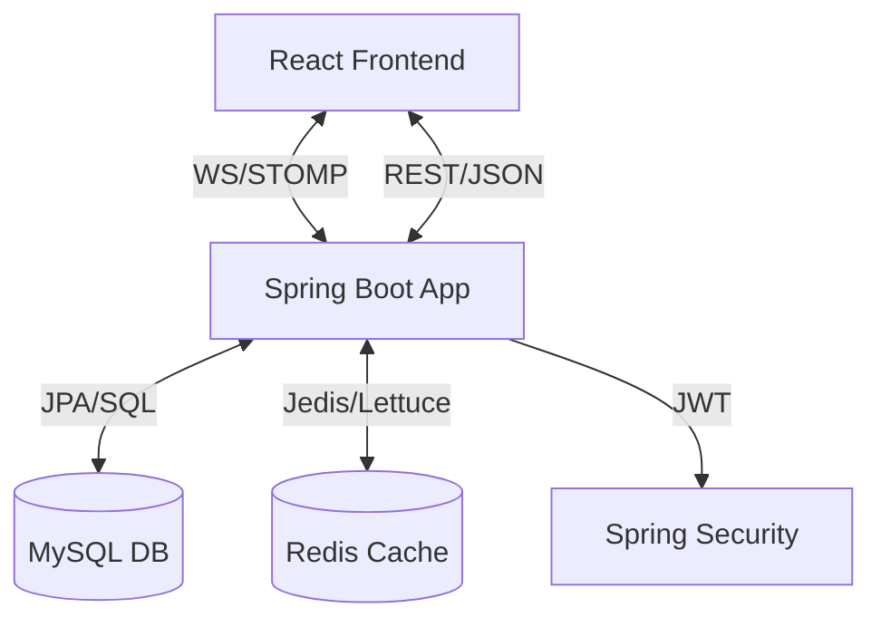

# Real-Time Chat Service 

A high-performance, production-ready real-time chat system built with **Java 21**, **Spring Boot 3.2**, and **Stateless JWT Authentication**. This project provides a robust foundation for 1-to-1 real-time communication with features like message persistence, presence tracking, and typing indicators.

##  System Design & Architecture

The system follows a modern micro-monolith architecture designed for scalability and real-time responsiveness.

### High-Level Flow
1.  **Authentication**: Users authenticate via JWT. The `SecurityConfig` ensures all REST and WebSocket connections are authorized.
2.  **Discovery**: Users can search for other registered users to initiate conversations.
3.  **Conversation Layer**: 1-to-1 conversations are unique pairs. If a conversation already exists between two users, the system retrieves the existing one.
4.  **Real-Time Engine**: Powered by **Spring WebSocket + STOMP**. 
    - **Messages**: Sent via `/app/chat.send` and broadcasted to `/topic/conversation.{id}`.
    - **Presence**: Tracked in **Redis** via `AuthChannelInterceptor`. Users are marked online/offline based on WebSocket connectivity and activity.
    - **Typing Indicators**: Lightweight events sent via `/app/chat.typing` to provide a "live" feel.
5.  **Data Persistence**: 
    - **MySQL**: Stores Users, Conversations, and Messages.
    - **Redis**: Stores real-time presence status for millisecond-latency lookups.

### Architecture Diagram (Conceptual)


---

##  Tech Stack

-   **Backend**: Spring Boot 3.2, Java 21, Spring Security, Spring Data JPA
-   **Real-Time**: Spring WebSocket, STOMP, SockJS
-   **Database**: MySQL 8.0
-   **Caching**: Redis (Presence Tracking & JWT)
-   **Frontend**: React, TypeScript, Tailwind CSS, Vite, Axios, StompJS

---

##  Key Features

-    **1-to-1 Real-Time Messaging**: Instant message delivery via WebSockets.
-    **User Search**: Find users by username to start new conversations.
-    **Presence System**: Real-time Online/Offline status indicators.
-    **Typing Indicators**: See when the other person is typing.
-    **Message History**: Persistent chat history with cursor-based pagination.
-    **Read Receipts**: Visual confirmation when messages are read.
-    **Automatic Reconnection**: Robust WebSocket connection management.

---

##  Core Modules

### 1. Authentication (`/api/auth`)
-   `POST /register`: Create a new account.
-   `POST /login`: Authenticate and receive a JWT.
-   `GET /me`: Get current authenticated user details.

### 2. Conversations (`/api/conversations`)
-   `GET /`: List all active conversations for the user, sorted by the latest activity.
-   `POST /`: Create or retrieve a 1-to-1 conversation using `targetUserId`.

### 3. Messages (`/api/messages`)
-   `GET /`: Fetch paginated message history for a specific conversation.
-   `POST /`: Send a message via REST (alternative to WebSocket).

### 4. Presence (`/api/presence`)
-   `GET /`: Get a map of online/offline statuses for all users.

---

##  Docker Deployment

The entire system (Backend, Database, Cache, Monitoring) can be started using Docker Compose.

### Quick Start with Docker
```bash
# 1. Build and start all services
docker-compose up -d --build

# 2. Check logs
docker-compose logs -f chat-app
```

### Services & Port Mappings
- **Chat API**: [http://localhost:8080](http://localhost:8080)
- **MySQL**: `localhost:3307` (Internal `3306`)
- **Redis**: `localhost:6379`
- **Prometheus**: [http://localhost:9090](http://localhost:9090)
- **Grafana**: [http://localhost:3000](http://localhost:3000) (User: `admin`, Pass: `admin`)

---

## 🛠 Installation & Setup

### Prerequisites
-   Java 21
-   MySQL 8.0 (Running on port 3307 or update `application.yml`)
-   Redis (Running on port 6379)

### Running the Backend
```bash
mvn clean install
mvn spring-boot:run
```

### Running the Frontend
```bash
cd chat-frontend
npm install
npm run dev
```

---

##  License
This project is licensed under the MIT License.
